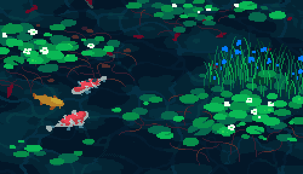

<p align="center">
  
</p>

<h2 align="center">
👋 Salut
</h2>

<div align="center">

  
  
  

</div>

<p align="center">
  
</p>

---

### ✨ À propos de moi

```md
Diplômé **Major de promotion (GPA 4.3)** en Informatique – Développement de Systèmes
d'Information (ISET), je poursuis actuellement un diplôme d'Ingénieur en Génie Logiciel
à l'**INSAT**, école d'ingénieurs publique tunisienne très sélective.
```

```md
Je conçois et développe des **systèmes logiciels propulsés par l'IA** — des pipelines RAG et
agents pilotés par LLM jusqu'aux produits full-stack qui les portent. Le vibe coding a sa place,
mais je vais plus loin : frameworks, MCPs, et agent skills, appuyés par des tests et des
pipelines CI — avec le prompt engineering et l'orchestration multi-agents en boucle comme
véritable levier du développement assisté par IA.
```

---

### 👨‍💻 Domaines d'expertise

- **Ingénierie IA** — systèmes de retrieval augmenté, orchestration LLM, workflows multi-agents, prompt & loop engineering, évaluation
- **Ingénierie Logicielle** — architecture, design patterns et systèmes scalables
- **Développement Full Stack** — livraison de produit de bout en bout, de la couche données à l'UI
- **DevOps & Cloud** *(en cours de montée en compétences)* — conteneurisation, CI/CD, infrastructure cloud, infrastructure-as-code
- **Sécurité & Fiabilité** — bonnes pratiques, authentification et API robustes

---

### 🌟 Philosophie

```md
 "Une ingénierie efficace, ce n'est pas écrire plus de code, c'est écrire le *bon* code."
```

---

<div align="center">

  [](https://www.linkedin.com/in/krichenyassine/)
  [](https://portfolio-yassine-krichens-projects.vercel.app/)
  [](assets/resume.pdf)
  [](README.md)

</div>

<div align="center">

<picture>
  <source media="(prefers-color-scheme: dark)" srcset="dist/github-snake-dark.svg" />
  <source media="(prefers-color-scheme: light)" srcset="dist/github-snake.svg" />
  
</picture>

</div>
